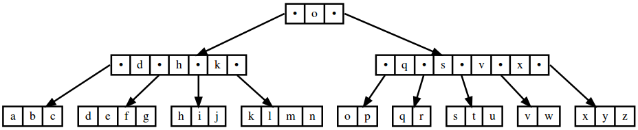

b-tree
======

*b-tree* is a B+ Tree implementation in Scala. *b-tree* is designed to be both generic (type parameters for keys and values, and an abstract type for node references) and general (doesn't care how the tree is stored). An extending class needs to implement a number of simple methods and node type that provide storage abstraction.

Scaladoc library documentation can be found at http://edadma.github.io/b-tree.

As an example, the following code

    import xyz.hyperreal.btree.{MemoryBPlusTree, FileBPlusTree}

    object Example1 extends App {
      val memoryTree = new MemoryBPlusTree[String, Any]( 5 )
      
      memoryTree.insertKeys( "k", "z", "p", "d", "b", "v", "h", "x", "o", "y", "c", "t", "j", "n", "f", "l", "s", "q", "i", "m", "e", "u", "w", "a", "g", "r" )
      memoryTree.diagram( "memoryTree" )
      
      val fileTree = new FileBPlusTree[String, Any]( "btree", 5, true )
      
      fileTree.insertKeys( "k", "z", "p", "d", "b", "v", "h", "x", "o", "y", "c", "t", "j", "n", "f", "l", "s", "q", "i", "m", "e", "u", "w", "a", "g", "r" )
      fileTree.diagram( "fileTree" )
      fileTree.close
	
      println( memoryTree.boundedKeysIterator(('>, "c"), ('<, "l")).mkString(", ") )
      println( memoryTree.reverseKeysIterator.mkString(", ") )
    }
	
produces identical B+ Tree structures in memory and on disk, and therefore the generated image files `memoryTree` and `fileTree` will be identical. The diagram that is produced is

The call to `boundedKeysIterator` above produces an iterator over the keys

    d, e, f, g, h, i, j, k
    
since these are the ones that are strictly between `c` and `l`. The call to `reverseKeysIterator` produces an iterator over the keys

    z, y, x, w, v, u, t, s, r, q, p, o, n, m, l, k, j, i, h, g, f, e, d, c, b, a